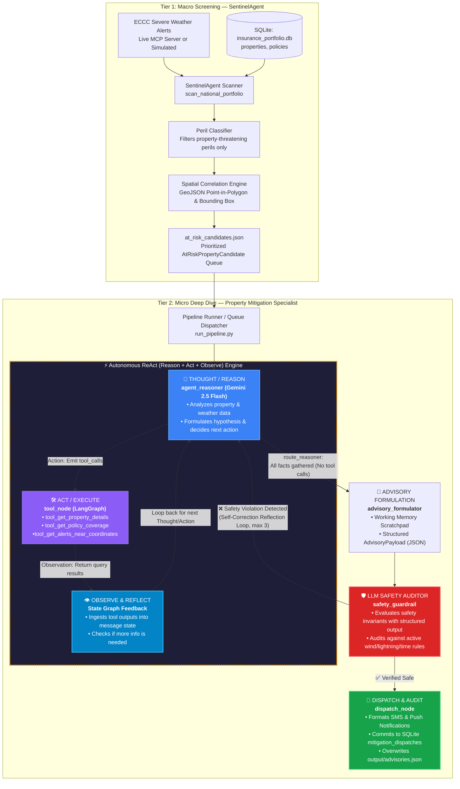

# Home Insurance Loss Mitigation Agentic System

[](https://www.python.org/)
[](https://github.com/langchain-ai/langgraph)
[](https://ai.google.dev/)
[](https://openai.com/)
[](https://weather.gc.ca/)
[](LICENSE)

**Home Insurance Loss Mitigation Agentic System** is an autonomous agentic platform designed for Canadian P&C insurers. The platform monitors real-time **Environment Canada (ECCC)** severe weather alerts, correlates threats spatially against insured properties, investigates structural vulnerabilities and coverage gaps using an agentic **ReAct** loop, audits recommendations with an **LLM Safety Guardrail**, and prepares personalized, timely micro-actions (SMS/Push) for policyholders before catastrophic weather strikes.

---

## 📊 System Architecture



The agentic pipeline operates in two coordinated stages:
1. **Tier 1: Portfolio Sentinel (Macro Screening)**
   - Ingests active ECCC weather warnings (live via MCP server or simulated).
   - Filters for severe property perils (tornado, thunderstorm, flood, blizzard, ice storm).
   - Runs GIS point-in-polygon and bounding-box queries against SQLite (`insurance_portfolio.db`).
   - Produces a prioritized candidate queue in `sentinel_system/at_risk_candidates.json`.
2. **Tier 2: Property Loss-Mitigation Specialist (Micro Investigation)**
   - **Agentic ReAct Engine**: Powered by **Gemini 2.5 Flash**, dynamically queries property policy details and its features (e.g., dwelling structure, roof age, foundation, policy deductibles, and endorsement gaps), and retrieves active localized weather alerts for each property.
   - **Targeted Loss-Mitigation Actions**: Analyzes policy terms, home features, and the active weather alert to generate prioritized, actionable steps for the policyholder to prevent damage and mitigate loss.
   - **LLM Safety Guardrail**: Evaluates proposed actions against safety rules (no outdoor roof work in winds $\ge 60$ km/h or lightning; life safety over property).
   - **Self-Correcting Reflection Loop**: Re-prompts the reasoner if violations occur (up to 3 iterations).
   - **Omnichannel Dispatch & Audit**: Formats SMS/Push alerts, logs audit records to SQLite (`mitigation_dispatches`), and saves consolidated JSON to `output/advisories.json`.

---

## 🧠 Context Engineering

To maximize reasoning accuracy and prevent hallucinations, the agent relies on structured context engineering:

1. **Semantic Alert Distillation (`distillers.py`)**:
   - Compresses verbose, multi-kilobyte ECCC CAP payloads into dense, standardized `PhysicalPerilParameters` (wind gusts in km/h, hail diameter in cm, rainfall mm, snowfall cm, lead time in minutes, tornado risk flags).
   - Strict anti-hallucination extraction: unmentioned values default to `None` (never assumed as zero) to prevent context pollution.
2. **Property & Endorsement Gap Highlighting**:
   - Converts raw relational records into compact property profiles.
   - Explicitly extracts policy coverage gaps (unendorsed sewer backup, uninsured overland water) as first-class context tokens so the agent proactively flags out-of-pocket exposures.
3. **Structured Working Memory Scratchpad (`PropertyAgentState`)**:
   - The agent maintains an explicit scratchpad recording:
     - `[OBSERVED HAZARD]`: Factual peril metrics extracted from weather alerts.
     - `[TEMPORAL WINDOW]`: Estimated lead time and duration.
     - `[EXPOSURE CROSS-REFERENCE]`: Matching peril to structure (e.g. 24y roof vs 90 km/h gusts; finished basement vs flash flood).
     - `[POLICY GAP ANALYSIS]`: Uninsured exposures.
     - `[SAFETY INVARIANT EVALUATION]`: Pre-dispatch verification of safety rules.
4. **Lean Context Injection for Safety Auditing**:
   - The LLM safety auditor receives only the distilled physical parameters, property vulnerabilities, and proposed advisory, avoiding noise from intermediate tool trajectories.

---

## 🌐 Live MCP vs. Simulated Alert Mode

| Mode | Source | Mechanism | Purpose |
| :--- | :--- | :--- | :--- |
| **Live** (`--alert-source live`) | Live ECCC MCP server | Stdio client (`python -m environment_canada_mcp`) | Real-time production hazard monitoring |
| **Simulated** (`--simulate` / `--alert-source simulated`) | Built-in ECCC catalog | In-memory spatial adapter in `PropertyMCPClient` | Deterministic benchmarking & reproducible evaluation |

### Behind the Scenes in Simulated Mode
- **Subprocess Bypassed**: Loads standardized warnings directly into memory without requiring an external MCP subprocess or network connection.
- **Exact ECCC Schema**: Every simulated alert preserves the live schema (`id`, `feature_id`, `feature_name`, `alert_code`, `alert_type`, `risk_colour`, `alert_text`, `geometry`).
- **Spatial Consistency**: Point-in-polygon routing behaves identically to live production.

---

## 🚀 Quick Start

### 1. Installation
```bash
git clone https://github.com/halizz821/home_insurance_mitigation.git
cd home_insurance_mitigation
uv sync  # or: pip install -e .
```

### 2. Environment Variables (`.env`)
Copy `.env_example` to `.env` and configure your API keys:
```bash
cp .env_example .env
```
```env
GOOGLE_API_KEY=your_gemini_api_key_here     # ReAct specialist & safety auditor
OPENAI_API_KEY=your_openai_api_key_here     # 3-Prompt LLM Judge evaluation
```

---

## 🏃 Running the Pipeline (`run_pipeline.py`)

```powershell
# 1. Full portfolio scan with simulated alerts across ALL at-risk candidates (default: no limit)
uv run python run_pipeline.py --simulate

# 2. Filter by province and limit to top 3 candidates
uv run python run_pipeline.py --simulate --province ON --limit 3

# 3. Directly investigate specific properties (skips macro scan)
uv run python run_pipeline.py --simulate --properties HOM-1051,HOM-1052

# 4. Live stream from Environment Canada MCP server
uv run python run_pipeline.py --limit 5

# 5. Demonstrate intentional safety violation & self-correcting reflection loop
uv run python run_pipeline.py --simulate --properties HOM-1001 --demo-reflection
```

### Key CLI Flags
- `--simulate`, `-s`: Use simulated Environment Canada warnings.
- `--properties`: Target a single property or comma-separated list (e.g. `HOM-1001,HOM-1051`).
- `--limit`, `-l`: Max candidates to investigate from macro scan (default: `None`, processes all candidates).
- `--province`, `-p`: Filter scan by province code (`ON`, `AB`, `SK`, etc.).
- `--demo-reflection`: Trigger an intentional safety invariant failure to demonstrate self-correction.
- `--reseed`: Reset and reseed SQLite database with portfolio properties.

---

## 🧪 LLM-as-a-Judge Evaluation (`evaluate_pipeline.py`)

Independent evaluation using **OpenAI GPT-4o** judging pre-generated advisories in `output/advisories.json` against independent SQLite ground truth and ECCC alerts:

| Dimension | Rubric Criteria (Scale: 1 – 5) |
| :--- | :--- |
| **1. Faithfulness** | Factual grounding in alert & property context. Zero tolerance for hallucinated wind speeds, hail sizes, or fabricated policy terms. |
| **2. Action Relevance** | Tailoring to dwelling vulnerabilities (roof age, foundation type) and explicit coverage gap warnings. |
| **3. Communication Clarity** | Conciseness, urgency, actionability, and lead-time feasibility in SMS & Push notifications. |

```powershell
# Evaluate all properties in output/advisories.json (simulated alerts)
uv run python evaluate_pipeline.py --alert-source simulated

# Evaluate against live ECCC alerts
uv run python evaluate_pipeline.py --alert-source live

# Evaluate specific properties and save to custom Excel file
uv run python evaluate_pipeline.py --alert-source simulated --properties HOM-1051,HOM-1052 -o evaluation.xlsx
```
*Outputs a 2-sheet Excel report (`Evaluation` with color-coded side-by-side data and `Rubrics` with scoring criteria).*

---

## 📈 Benchmark Results

Empirical evaluation from `evaluation.xlsx` across **42 diverse Canadian test properties** spanning 6 regions (including Ontario, Alberta, and Saskatchewan, covering major urban centres and remote edge cases such as **Wood Buffalo Nat. Park near Peace Point and Lake Claire, AB** with 80 mm rainfall & flood gap, and **Uranium City, SK** with a 95 km/h blizzard & aged roof):

| Metric | Score (out of 5.0) | Assessment |
| :--- | :---: | :--- |
| **Faithfulness & Anti-Hallucination** | **4.95 / 5.0** | Factual grounding across weather alerts, structural specs, and policy terms with zero hallucinated peril metrics |
| **Action Relevance & Property Tailoring** | **4.88 / 5.0** | Precise adaptation to dwelling age, basement/foundation type, and explicit unendorsed flood/sewer gaps |
| **Communication Clarity & Actionability** | **4.93 / 5.0** | High urgency, conciseness, and feasible lead-time micro-actions in dispatched SMS and Push channels |
| **Composite Quality Score** | **4.92 / 5.0** | **Production-grade reliability across full 42-property portfolio** |

---

## 📁 Repository Structure

```text
├── evaluate_pipeline.py          # LLM-as-a-Judge evaluation runner (OpenAI GPT-4o)
├── run_pipeline.py               # End-to-end multi-agent orchestration pipeline
├── pyproject.toml                # Project dependencies, build specs & pytest configuration
├── evaluation.xlsx               # Empirical benchmark report across 42 Canadian properties
├── output/
│   └── advisories.json           # Consolidated agent mitigation advisories & dispatch audits
├── evaluation/                   # LLM-as-a-Judge Evaluation Module
│   ├── llm_judge.py              # GPT-4o multi-prompt evaluator (Faithfulness, Relevance, Clarity)
│   ├── rubrics.py                # 5-point evaluation rubrics & scoring criteria
│   ├── excel_exporter.py         # Formatted two-sheet Excel report generator
│   └── state.py                  # Pydantic evaluation schemas & evaluation models
├── sentinel_system/              # Tier 1: Macro Screening & GIS Spatial Engine
│   ├── run_sentinel.py           # Standalone Sentinel runner for portfolio hazard screening
│   ├── db/
│   │   ├── database.py           # SQLite connection manager, bounding-box & FSA queries
│   │   ├── schema.sql            # Relational schema (properties, policies, dispatches)
│   │   ├── seed_data.py          # Synthetic dataset generator for 42 Canadian properties
│   │   └── insurance_portfolio.db# SQLite portfolio database
│   ├── scanner/
│   │   ├── sentinel_agent.py     # SentinelAgent: Peril classifier & portfolio GIS scanner
│   │   ├── schemas.py            # Pydantic models (AtRiskPropertyCandidate, ScanSummary)
│   │   └── zone_mapper.py        # GIS point-in-polygon & bounding-box spatial geometry
│   ├── tools/
│   │   └── mcp_client.py         # Synchronous Environment Canada MCP adapter & simulated feed
│   └── tests/                    # Sentinel unit & integration tests (db, mcp, scanner, zones)
├── property_investigator/        # Tier 2: Micro Deep Dive Specialist (LangGraph ReAct)
│   ├── run_property_agent.py     # Property specialist investigation loop & CLI visualizer
│   ├── agent/
│   │   ├── graph.py              # LangGraph StateGraph (ReAct cycle + Reflection loop)
│   │   ├── nodes.py              # Agent nodes (agent_reasoner, advisory_formulator, safety_guardrail)
│   │   └── state.py              # LangGraph state schema (working memory scratchpad & payloads)
│   ├── context/
│   │   ├── distillers.py         # Semantic distillers (CAP alert compaction & policy gap extraction)
│   │   └── prompts.py            # System prompts & reflection critique templates
│   ├── tools/
│   │   └── database_tools.py     # LangChain @tool definitions (property, policy, weather perils)
│   └── tests/                    # Specialist test suite (graph, tools, distillers, guardrails)
```

---

## 📄 License
MIT License. See [LICENSE](LICENSE) for details.

---

> [!NOTE]
> **Disclaimer on Portfolio Data**: All policyholder names, contact numbers, email addresses, property details, and policy numbers in `insurance_portfolio.db` (and `seed_data.py`) are entirely synthetic/dummy data generated solely for demonstration, testing, and benchmarking purposes. None of the records represent real individuals, actual properties, or active insurance policies.
