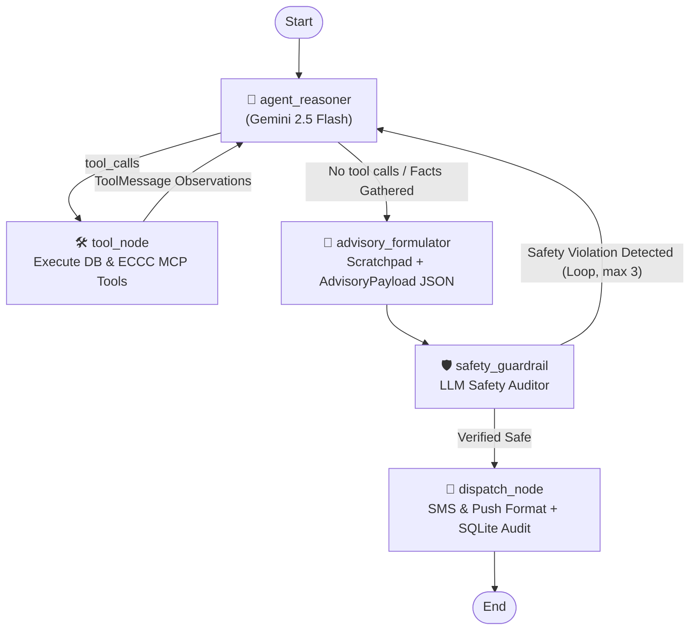

# Property Mitigation Specialist (Micro Investigation Tier)

Part of the **[Home Insurance Loss Mitigation Agentic System](https://github.com/halizz821/home_insurance_mitigation)**.

An autonomous, stateful agentic system built with **LangGraph**, **Google Gemini 2.5 Flash**, SQLite, and the **Environment Canada Weather Alerts MCP Server**.

The specialist acts as the **Tier 2 Micro Investigator**: it receives at-risk properties flagged by the Portfolio Sentinel (Tier 1) or specified by an operator, performs an autonomous **ReAct** investigation across property records and localized meteorological warnings, evaluates recommendations through an **LLM Safety Guardrail**, self-corrects via a reflection loop if safety hazards are detected, and formats actionable, personalized loss-mitigation advisories.

---

## 🏗️ Agentic Architecture & Graph Flow

The agent is compiled as a stateful LangGraph `StateGraph(PropertyAgentState)` in [`agent/graph.py`](agent/graph.py):



### Graph Nodes

1. **`agent_reasoner`** ([`agent/nodes.py`](agent/nodes.py)):
   - Powered by **Google Gemini 2.5 Flash**.
   - Deliberates over the property's structural context and active meteorological threats using an autonomous **ReAct (Thought $\rightarrow$ Action $\rightarrow$ Observation)** cycle.
2. **`tool_node`**:
   - Executes LangChain tools and feeds real-world database and meteorological observations back into the agent's message state:
     - `tool_get_property_details`: Fetches dwelling type, roof age/material, foundation/basement type, sump pump, and backwater valve.
     - `tool_get_policy_coverage`: Fetches base deductible, wind/hail deductible, sewer backup endorsement, and overland water endorsement.
     - `tool_get_alerts_near_coordinates`: Queries localized ECCC weather alerts intersecting the property's coordinates and immediately distills physical perils (wind speed, hail size, precipitation amount, timeline).
3. **`advisory_formulator`**:
   - Synthesizes the agent's **Working Memory Scratchpad** and drafts structured loss-mitigation micro-actions.
   - Highlights policy coverage gaps (unendorsed overland water or sewer backup) to warn policyholders where insurance will not cover damage.
4. **`safety_guardrail`**:
   - Invokes an LLM-based safety auditor with structured output (`SafetyAuditResult`).
   - Verifies deterministic safety invariants:
     - **Outdoor Hazard Rule**: Prohibits outdoor roof or gutter mitigation when active wind gusts $\ge 60$ km/h or lightning is active.
     - **Life Safety Over Property**: In tornado warnings or lead times under 15 minutes, sheltering (basement/interior room) must take absolute precedence over property protection.
     - **Lead Time Feasibility**: Actions must be physically achievable within the arrival window.
   - **Self-Correcting Reflection**: If violations are found, routes back to `agent_reasoner` with the critique (up to 3 reflection attempts).
5. **`dispatch_node`**:
   - Formats customer communication payloads for SMS and Push notifications.
   - Commits an immutable audit record to the SQLite database table `mitigation_dispatches`.

---

## 🚀 Usage & Standalone Execution

Run the standalone specialist agent using [`run_property_agent.py`](run_property_agent.py):

```powershell
# Investigate a property with simulated weather warnings
uv run python property_investigator/run_property_agent.py --property_id HOM-1051 --simulated-alerts

# Investigate using live Environment Canada weather MCP stream
uv run python property_investigator/run_property_agent.py --property_id HOM-1001

# Batch investigate top candidates generated by Sentinel macro-scan
uv run python property_investigator/run_property_agent.py --batch-from-sentinel --limit 3 --simulated-alerts

# Demonstrate safety invariant violation and self-correcting reflection loop
uv run python property_investigator/run_property_agent.py --property_id HOM-1001 --simulated-alerts --demo-reflection

# Show verbose scratchpad deliberation outputs
uv run python property_investigator/run_property_agent.py --property_id HOM-1052 --simulated-alerts --verbose
```

---

## 📁 Directory Structure

```text
property_investigator/
├── README.md                   # Property investigator tier documentation
├── run_property_agent.py       # Standalone CLI runner with Rich dashboard
├── agent/
│   ├── __init__.py             # Agent package exports
│   ├── graph.py                # LangGraph StateGraph assembly & conditional routing
│   ├── nodes.py                # Reasoner, tool_node, safety_guardrail, dispatch_node
│   └── state.py                # PropertyAgentState schema & working memory models
├── context/
│   ├── __init__.py             # Context package exports
│   ├── distillers.py           # Semantic alert & property distillation middleware
│   └── prompts.py              # System prompts, guardrail criteria & reflection templates
├── tools/
│   ├── __init__.py             # Tools package exports
│   └── database_tools.py       # LangChain @tool definitions (property, policy, weather perils)
└── tests/
    ├── test_agent_graph.py     # LangGraph compilation & workflow routing tests
    ├── test_database_tools.py  # SQLite query and coordinate weather tool tests
    ├── test_distillers.py      # Semantic distillation & parameter extraction tests
    ├── test_guardrails.py      # Deterministic invariant & safety reflection tests
    └── test_live_distillation.py # Live MCP alert distillation pipeline tests
```

---

> [!NOTE]
> **Disclaimer on Portfolio Data**: All policyholder names, contact numbers, email addresses, property details, and policy numbers used in testing are entirely synthetic/dummy data generated solely for demonstration, testing, and research purposes. None of the records represent real individuals or active insurance policies.
