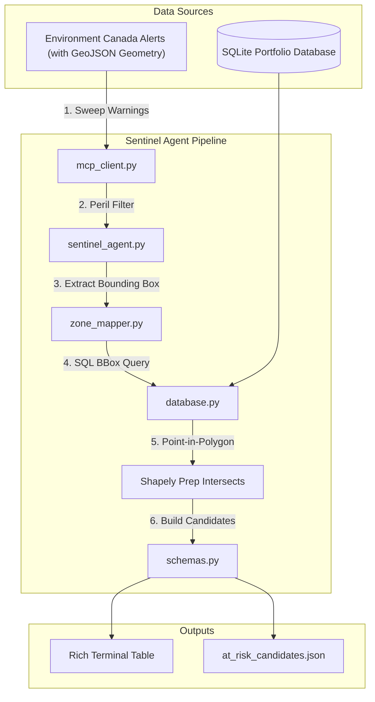

# 🛡️ Sentinel System: Portfolio Weather Warning Scanner

Part of the **[Home Insurance Loss Mitigation Agentic System](https://github.com/halizz821/home_insurance_mitigation)**.

> **Tier 1 Macro-Screening Sentinel for Canadian P&C Insurance**  
> Monitors real-time Canadian weather warnings, classifies property-threatening perils, and spatially correlates affected zones to policyholders in your portfolio database.

---

## 📋 Table of Contents

- [Overview](#overview)
- [How It Works](#how-it-works)
- [Connection to Environment Canada MCP](#connection-to-environment-canada-mcp)
- [Project Architecture](#project-architecture)
- [Usage Guide](#usage-guide)
  - [1. Real-time Live Weather Scan](#1-real-time-live-weather-scan)
  - [2. Simulated Warning Scan (Demo / Testing)](#2-simulated-warning-scan-demo--testing)
  - [3. Province Filtering](#3-province-filtering)
  - [4. Reseeding the Portfolio Database](#4-reseeding-the-portfolio-database)
  - [5. CLI Options Reference](#5-cli-options-reference)
- [Understanding the Output](#understanding-the-output)
- [Codebase Learning Guide](#codebase-learning-guide)

---

## 🎯 Overview

In property and casualty (P&C) insurance, timely awareness of catastrophe perils (tornadoes, severe thunderstorms, blizzards, freezing rain) is critical to protect policyholders and prepare claims operations.

**Sentinel System** acts as the high-speed **Tier 1 Macro-Screening Sentinel** in the agentic pipeline:
- Connects directly to the **Environment Canada MCP Server** to sweep national weather alerts with GeoJSON geometry (or loads standardized simulated warnings).
- Filters out non-structural minor advisories (such as fog, dust, or frost) to focus strictly on property-threatening perils.
- Performs true **GIS Point-in-Polygon spatial correlation** using `shapely`: matches warning polygons directly to property coordinates across all Canadian provinces and territories.
- Executes accelerated bounding-box SQL queries against the insured portfolio database (`insurance_portfolio.db`).
- Generates an audited, deduplicated list of at-risk properties (`at_risk_candidates.json`) ready for downstream specialist investigation.

---

## ⚙️ How It Works



---

## 🔌 Connection to Environment Canada MCP

This project integrates with the [MCP Weather Alert Server](https://github.com/halizz821/MCP_wearther_alert):

1. **Dependency Registration**: In root `pyproject.toml`, the server repository is installed directly via Git:
   ```toml
   [tool.uv.sources]
   environment-canada-mcp = { git = "https://github.com/halizz821/MCP_wearther_alert" }
   ```
2. **LangChain MCP Integration**: In `tools/mcp_client.py`, `langchain.mcp.MCPAdapter` manages the stdio background subprocess:
   ```python
   from langchain.mcp import MCPAdapter

   WEATHER_MCP_CONFIG = {
       "mcpServers": {
           "environment_canada": {
               "command": sys.executable,
               "args": ["-m", "environment_canada_mcp"],
               "env": os.environ,
           }
       }
   }
   ```
   The `EnvironmentCanadaMCPClient` wraps the underlying async MCP tools, exposing a clean, synchronous interface (`get_alert_summary`, `search_alerts`, `get_alerts_near_coordinates`) and built-in simulation support for offline testing.

---

## 📁 Project Architecture

```text
sentinel_system/
├── README.md                   # Sentinel system documentation
├── run_sentinel.py             # CLI entry point with Rich terminal dashboard
├── at_risk_candidates.json     # Generated candidate queue for downstream agents
├── db/
│   ├── __init__.py             # Database package exports (init_db, get_connection)
│   ├── schema.sql              # SQLite DDL (policyholders, properties, policies)
│   ├── seed_data.py            # Synthetic dataset generator for 42 Canadian properties
│   ├── database.py             # Connection manager, bounding-box & spatial SQL queries
│   └── insurance_portfolio.db  # Local SQLite portfolio database
├── scanner/
│   ├── __init__.py             # Scanner package exports (SentinelAgent, schemas, zone_mapper)
│   ├── schemas.py              # Pydantic models (AtRiskPropertyCandidate, ScanSummary)
│   ├── zone_mapper.py          # ECCC alert geometry parsing & Shapely point-in-polygon correlation
│   └── sentinel_agent.py       # Core orchestration & catastrophe peril filtering
├── tools/
│   ├── __init__.py             # Tools package exports
│   └── mcp_client.py           # Synchronous client wrapper for langchain.mcp MCPAdapter
└── tests/
    ├── test_db.py              # Database & query tests
    ├── test_mcp_client.py      # MCP client wrapper & stdio tests
    ├── test_sentinel.py        # End-to-end scanner tests
    └── test_zone_mapper.py     # Weather zone to postal code mapping tests
```

---

## 📖 Usage Guide

Sentinel System operations are run through `run_sentinel.py` from the project repository root.

### 1. Real-time Live Weather Scan
To query live weather alerts directly from Environment Canada across the entire country:

```bash
uv run python sentinel_system/run_sentinel.py
```
*Note: If there are currently no active severe weather warnings in Canada, the scan will report zero exposed properties.*

---

### 2. Simulated Warning Scan (Demo / Testing)
Because severe weather is seasonal and unpredictable, a realistic simulation mode is built-in. It injects a Kingston Severe Thunderstorm Warning, an Ottawa Tornado Warning, and a Calgary Snowfall Warning (while ignoring minor fog advisories):

```bash
uv run python sentinel_system/run_sentinel.py --simulate
```

This demonstrates the end-to-end filtering, spatial matching, and table rendering even on clear weather days.

---

### 3. Province Filtering
To restrict the macro scan to a specific Canadian province (e.g. Ontario or Alberta):

```bash
# Filter alerts for Ontario
uv run python sentinel_system/run_sentinel.py --simulate --province ON

# Filter alerts for Alberta
uv run python sentinel_system/run_sentinel.py --simulate --province AB
```

---

### 4. Reseeding the Portfolio Database
The project comes with a synthetic database of Canadian residential properties spread across Kingston, Ottawa, Toronto, Calgary, and Edmonton. To reset or reseed the database:

```bash
uv run python sentinel_system/run_sentinel.py --reseed
```

---

### 5. CLI Options Reference

| Argument | Short Flag | Default | Description |
| :--- | :--- | :--- | :--- |
| `--simulate` | `-s` | `False` | Run scan against simulated severe warnings. |
| `--province` | `-p` | `None` | Two-letter Canadian province code (`ON`, `AB`, `BC`, etc.). |
| `--output` | `-o` | `at_risk_candidates.json` | Destination path for the exported JSON candidates. |
| `--reseed` | | `False` | Reset and reload synthetic property portfolio data. |
| `--help` | `-h` | | Show help message with all available options. |

---

## 📄 Understanding the Output

When matching properties are detected, Sentinel exports an audited JSON file (`at_risk_candidates.json`). Each candidate contains the complete exposure context needed for underwriting or policyholder contact:

```json
[
  {
    "property_id": "HOM-1001",
    "policy_id": "POL-1001",
    "policy_number": "POL-ON-2026-1001",
    "policyholder_name": "Eleanor Vance",
    "policyholder_phone": "+1-613-555-0101",
    "policyholder_email": "eleanor.vance@example.ca",
    "address": "142 Johnson St",
    "city": "Kingston",
    "province": "ON",
    "postal_code": "K7L 1X9",
    "fsa": "K7L",
    "coordinates": {
      "latitude": 44.2298,
      "longitude": -76.486
    },
    "dwelling_type": "Single Family Detached",
    "roof_type": "Asphalt Shingle",
    "roof_age_years": 14,
    "basement_type": "Full Finished",
    "has_sump_pump": true,
    "has_backwater_valve": false,
    "base_deductible": 1000.0,
    "wind_hail_deductible": 2500.0,
    "sewer_backup_endorsed": true,
    "overland_water_endorsed": true,
    "triggering_alert_id": "urn:eccc:alert:20260922:on-kingston-ts-warning",
    "feature_id": "043200",
    "triggering_event": "Severe Thunderstorm Warning",
    "headline": "Severe thunderstorm warning in effect",
    "urgency": "Immediate",
    "severity": "Severe"
  }
]
```

---

## 💡 Codebase Learning Guide

If you are exploring this codebase to learn agent development with MCP:

1. **[scanner/schemas.py](scanner/schemas.py)**: Start here to see the data model contract (`AtRiskPropertyCandidate`).
2. **[tools/mcp_client.py](tools/mcp_client.py)**: Study how Python uses `langchain.mcp.MCPAdapter` to communicate with the MCP server subprocess via stdio and expose a clean synchronous interface.
3. **[scanner/zone_mapper.py](scanner/zone_mapper.py)**: Learn how meteorological forecast alert geometries and polygon coordinate rings are resolved using Shapely point-in-polygon tests.
4. **[scanner/sentinel_agent.py](scanner/sentinel_agent.py)**: See how the orchestrator ties together MCP data retrieval, deterministic peril filtering, and SQL queries.
5. **[run_sentinel.py](run_sentinel.py)**: Review how the command-line interface handles arguments and renders interactive tables with `rich`.

---

> [!NOTE]
> **Disclaimer on Portfolio Data**: All policyholder names, contact numbers, email addresses, property details, and policy numbers in `insurance_portfolio.db` (and `seed_data.py`) are entirely synthetic/dummy data generated solely for demonstration, testing, and benchmarking purposes. None of the records represent real individuals, actual properties, or active insurance policies.
